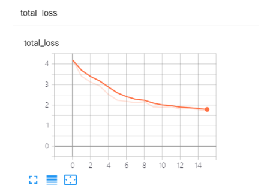

# Keras-mask-detection

Using keras to build fastercnn, and then mask detection

#### Introduction

Use keras to build fasterRCNN and train on the VOC format mask data set to achieve the purpose of detecting whether the mask is worn in the crowd

#### Installation tutorial

1. Need numpy, matplotlib, scikit-learn, Pillow, tensorflow1.x, keras
2. pip install package or conda install package
3. If you want to train, you need to use VOC format data set, you need to install labelimg

#### Instructions for use

1. There must be a model weight file under ./model_data/logs. Because the weight is large, it is not uploaded
2. Under ./theory is the process of doing this thing and the explanation of the principle to facilitate understanding of the code
3. Under ./net is the model construction of fasterRCNN
4. run.py is used to directly run to see the results, voctrain.py is used to train your own VOC data set

#### The results show that

